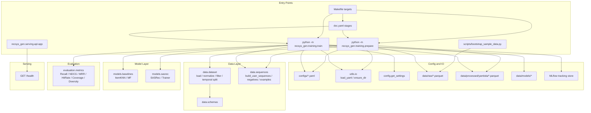

# Architecture Compute Graph

This graph traces the executable entry points into the package and the major compute/data dependencies they activate.



## Read the graph as a compute pipeline

The main architecture is not request-driven yet. It is batch-driven:

1. `bootstrap_sample_data.py` can synthesize raw parquet input.
2. `training.prepare` converts raw interactions into normalized splits and sequence tables.
3. `training.train` loads prepared artifacts, trains either baseline or sequential models, evaluates them, and writes artifacts plus MLflow logs.
4. `serving.api` is currently isolated from the training stack and only exposes a health endpoint.

## Mathematical shape of the compute graph

At a coarse level, the system is a composition

```text
F = T ∘ P ∘ B
```

where:

- `B` maps local raw inputs into a parquet interaction table
- `P` maps that table into prepared artifacts `{train, val, test, sequences}`
- `T` maps prepared artifacts into `{model artifacts, metrics, MLflow run}`

More explicitly:

```text
B: ∅ -> X_raw
P: X_raw -> (X_train, X_val, X_test, S)
T: (X_train, X_val, S, θ) -> (M_θ, metrics, run_id)
```

with `θ` denoting the selected model configuration.

Training then branches by model family:

```text
T(·) =
  T_itemknn(·)   if θ.name = itemknn
  T_mf(·)        if θ.name = mf
  T_sasrec(·)    if θ.name = sasrec
```

The important architectural fact is that `prepare` is a shared upstream operator and `train` is a model-specific downstream operator. In graph terms, `prepare` has high out-degree into all training runs, while `serving.api` is currently disconnected from learned model artifacts.
